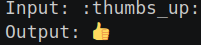
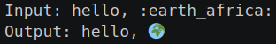

# CS50 Emojize Solution
CS50’s Introduction to Programming with Python Emojize problem solution.

This program was developed according with Python's good practices and based on [PEP 8 - Style Guide for Python Code](https://peps.python.org/pep-0008/)

### Version
1.0.0


## Resources
* [CS50 Emojize Problem](https://cs50.harvard.edu/python/2022/psets/4/emojize/)
* [emoji list](https://carpedm20.github.io/emoji/all.html?enableList=enable_list_alias)


## Getting Started

These instructions will guide you to copy the project from the repository and run it.

### Prerequisites

Things you need to have installed:
* [Python](https://docs.python.org/3/using/unix.html#getting-and-installing-the-latest-version-of-python)
* [emoji library](https://pypi.org/project/emoji/)

### Local Installation

Basically clone the project from the remote repository to the local machine, using the git commands.

```
$git clone [URL].git
```

### Run
To run the project, first check that the emoji library is installed, then run the python command.

To install the emoji library, write the following command-line into the terminal:
```
$pip install emoji
```

To run the program, write the command-line into the terminal:
```
$python emojize.py
```
Then write the text with the emoji symbol code:
```
$Input: :thumbs_up:
```

```
$hello, :earth_africa:
```



## Authors

* **BEOM &copy; 2024**
